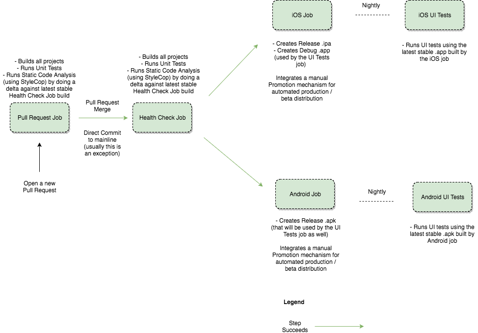

# Xamarin - Continuous Integration with Unit & Acceptance (UI) Tests

### Description
**Xamarin - Continuous Integration with Unit & Acceptance (UI) Tests** is a sample Xamarin (iOS & Android) application built to highlight the infrastructure for running unit tests and Acceptance (UI) Tests using Jenkins.

The infrastructure is built around the default VS for Mac Xamarin Template Application.

**Note**: The main purpose of this repository is to highlight the infrastructure surrounding automated Unit & Acceptance (UI) Tests and **NOT** on Unit Testing and Acceptance (UI) Testing design patterns (maybe just slightly on Specflow & Page Object Pattern integration). Please see the **Useful Resources** section for Unit Testing and Acceptance (UI) Testing design tips and tricks.

All logic found in the *.sh* scripts can also be found in the *.cake* files used by [Cake Build](https://github.com/cake-build/cake). Feel free to go with either *bash* scripts or *.cake* scripts on your own projects - __you don't have to use both approaches__. We suggest having a look at the *.sh* files first to understand what happens under the hood and after that you can migrate to the more maintainable *.cake* scripts.
### Requirements

* macOS 10.12.6+
* Xamarin.iOS 11.3.0.47+
* Xamarin.Android 8.0.2.1+
* VS for Mac 7.2.2+ - Including the following extensions:
    - [StyleCop Support](https://github.com/DarkCloud14/MonoDevelop.StyleCop/releases)
    - [Straight8's SpecFlow Integration](https://github.com/straighteight/SpecFlow-VS-Mac-Integration/releases/tag/1.11.0.0)
* Jenkins 2.73.2+ (Running as a Launch Agent - so it can open the simulator / emulator) - Including the following plugins
    - [NUnit](https://wiki.jenkins.io/display/JENKINS/NUnit+Plugin)
    - [Cucumber Reports (used for Specflow reports)](https://wiki.jenkins.io/display/JENKINS/Cucumber+Reports+Plugin)
    - [Violations (used for StyleCop warnings integration)](https://wiki.jenkins.io/display/JENKINS/Violations)
    - [Copy Artifact (used to copy the .apk / .app from the jobs that build them into the jobs that run the tests)](https://wiki.jenkins.io/display/JENKINS/Copy+Artifact+Plugin)
    - [EnvInject (used to inject several environment variables)](https://wiki.jenkins.io/display/JENKINS/EnvInject+Plugin)
* Xcode 9.1+ (Including iOS 10.x and iOS 11.x Simulators)
* Android SDK - Including the following system images (depending on what emulators you want to run your UI Tests): 
    - *system-images;android-21;google_apis;x86_64*
    - *system-images;android-23;google_apis;x86_64*
    - *system-images;android-24;google_apis;x86_64*

### High Level CI Pipeline

* **Pull Request Job**
    - Is triggered whenever creating a new Pull Request
    - Runs [*Scripts/healthcheck.sh*](Scripts/healthcheck.sh) that does the following:
        - Builds all projects (Jenkins.iOS, Jenkins.Droid, Jenkins.UnitTests, Jenkins.UITests)
        - Using **StyleCop.MsBuild** referred by each project individually it outputs a **obj/Debug/StyleCopViolations.xml** report file for each project
        - Runs unit tests using **NUnit.ConsoleRunner** (the unit tests are written only for the shared project) - the test report can be found in the solution root folder in **TestResult.xml**
        - If you would want to run unit tests for the specific iOS and Android projects those tests would need to run on simulators / emulators / actual devices. (usually unit testing just the shared project should suffice)        
    - Fails the build if:
        - Any of the projects fails building
        - Any unit test failed
        - StyleCop warnings are introduced (doing a delta with the main branch)
    - Adds a Success / Fail comment to the Git Server (e.g. Stash/BitBucket Server)
* **Health Check Job**
    - Is triggered whenever merging a Pull Request or doing a direct Commit & Push on the main branch
    - Runs [*Scripts/healthcheck.sh*](Scripts/healthcheck.sh) that does the following:
        - Builds all projects (Jenkins.iOS, Jenkins.Droid, Jenkins.UnitTests, Jenkins.UITests)
        - Using **StyleCop.MsBuild** referred by each project individually it outputs a **obj/Debug/StyleCopViolations.xml** report file for each project
        - Runs unit tests using **NUnit.ConsoleRunner** (the unit tests are written only for the shared project) - the test report can be found in the solution root folder in **TestResult.xml**
        - If you would want to run unit tests for the specific iOS and Android projects those tests would need to run on simulators / emulators / actual devices. (usually unit testing just the shared project should suffice)
    - Fails the build if:
        - Any of the projects fails building
        - Any unit test failed
        - StyleCop warnings are introduced (doing a delta with the main branch)
    - Sends an email notification to the interested parties if the build fails
    - Triggers **iOS** and **Android** jobs on success
* **iOS Job**
    - Is triggered after each successful **Health Check Job** build
    - Runs [*iOS/Scripts/build_ipa.sh*](iOS/Scripts/build_ipa.sh) that does the following: 
        - Builds **Release** configuration **.ipa** (depending on your backend environments you might have several other configurations that you'd want to build)
    - Runs [*iOS/Scripts/build_app.sh*](iOS/Scripts/build_app.sh) that does the following:
        - Builds the **Debug** configuration **.app** that is used for running the UI Tests. It is **important** that whatever configuration we choose to build (besides the **Release** one) it should link the **Xamarin.TestCloud.Agent** library and call **Xamarin.Calabash.Start();** in [**AppDelegate.cs**](iOS/AppDelegate.cs) taking into account the **ENABLE_TEST_CLOUD** flag which should not be used for the **Release** configuration
        - It is important that the **Debug|iPhoneSimulator** builds a single architecture (such as x86_x64) as you **cannot** install **FAT** binaries on the simulator
    - Integrates manual Promotion mechanisms for automatic store / beta distribution (based on the green light given by the automated Acceptance (UI) Tests, QA Team and Stakeholders)
    - Sends an email notification to the interested parties if the build fails
* **Android Job**
    - Is triggered after each successful **Health Check Job** build
    - Runs [*Droid/Scripts/build_apk.sh*](Droid/Scripts/build_apk.sh) that does the following: 
        - Builds **Release** configuration **.apk** - that is aligned and signed using **Droid/Scripts/ProductionKey.keystore** (depending on your backend environments you might have several other configurations that you'd want to build)
        - It is **important** that the **Release** configuration contains emulator architectures as well (such as x86_x64 - which by default it doesn't) so the **.apk** can be installed on the emulator
        - Also you should consider keeping the **Keystore Password** in a place outside your codebase
    - Integrates manual Promotion mechanisms for automatic store / beta distribution (based on the green light given by the automated Acceptance (UI) Tests, QA Team and Stakeholders)
    - Sends an email notification to the interested parties if the build fails
* **iOS UI Tests Job**
    - Is triggered nightly
    - It runs the UI Tests on the **.app** artifact created by the latest successful **iOS Job** build
    - Runs [*UITests/Scripts/run_ios_tests.sh*](UITests/Scripts/run_ios_tests.sh) that does the following: 
        - It creates (if it doesn't already exist) an iOS Simulator based on the passed name, device type and iOS runtime parameters (disabling the keyboard settings for fixing text entry issues)
        - It runs the UI automated tests by updating the resource files found in the [**Settings**](UITests/Settings) folder with iOS specific settings
        - It is **important** that the desired simulator runtimes are already installed on the machine
    - Consumes the **.json** reports using the [Cucumber Reports Plugin](https://wiki.jenkins.io/display/JENKINS/Cucumber+Reports+Plugin) that can be found in **UITests/bin/debug**
    - Fails the build if any of the tests failed (sending an email to the interested parties)
    - Improvement opportunities:
        - Can be (fairly easily) updated to run the tests in parallel on multiple simulators
        - Can be (failry easily) updated to run the tests alternatively (based of the Jenkins job build number) on different iOS Simulator versions
* **Android UI Tests Job**
    - Is triggered nightly
    - It runs the UI Tests on the **.apk** artifact created by the latest successful **Android Job** build
    - Runs [*UITests/Scripts/run_android_tests.sh*](UITests/Scripts/run_android_tests.sh) that does the following: 
        - It creates (overriding if already exists) and Android Emulator based on the passed name, and API level parameters (disabling the software keyboard for easy text entry)
        - It runs the UI automated tests by updating the resource files found in the [**Settings**](UITests/Settings) folder with Android specific settings
        - It is **important** that the desired emulator system-images are already installed on the machine
    - Consumes the **.json** reports using the [Cucumber Reports Plugin](https://wiki.jenkins.io/display/JENKINS/Cucumber+Reports+Plugin) that can be found in **UITests/bin/debug**
    - Fails the build if any of the tests failed (sending an email to the interested parties)
    - Improvement opportunities:
        - Can be (fairly easily) updated to run the tests in parallel on multiple emulators
        - Can be (failry easily) updated to run the tests alternatively (based of the Jenkins job build number) on different Android emulator versions

### FAQ

#### Q: Why bundling everything in script instead of havin the content of the scripts directly in our Jenkins jobs?
A: Generally it is a good practice that all your build / configuration scripts are kept alongside your codebase. This make it easy to run the scripts on any machine (independently of your CI server) and it also helps tracking any changes (and their reason). Build / configuration scripts should be **first class citizens**.

#### Q: What about Jenkins jobs? Shouldn't they be scripted as well?
A: Yes, they should. [Pipeline](https://jenkins.io/doc/book/pipeline/) is a good way to achieve that. However, you want to keep your CI specific scripts to a minimum, in order to easily change it if needed. For the purpose of this sample project we didn't include the actual Jenkins job config.xml / Jenkinsfiles but we hope that the **High Level CI Pipeline** section does a good job explaining how they should be configured.

#### Q: Why did you use the Resources [(Settings folder)](UITests/Settings) for UITests project?
A: We wanted to find a mechanism that allows easy IDE & Command Line integration. The idea was the following - if you want to use the IDE you leave the [**AndroidSettings.resx**](UITests/Settings/AndroidSettings.resx) and the [**IosSettings.resx**](UITests/Settings/IosSettings.resx) empty. If you want to use the Command Line (by running the tests via Jenkins) you should insert the corresponding values in the mentioned files. For choosing on what platform you want to run the tests (iOS or Android) you should change the [**GlobalSettings.resx**](UITests/Settings/GlobalSettings.resx) file regardless of using the IDE or the Command Line

#### Q: Why do all my Steps.cs classes inherit from ReportingStepDefinitions?
A: Unfortunately Specflow free version sucks at reporting (compared for instance with the Java implementation of Cucumber). By using **SpecNuts.Json** you can generate the same **.json** style reports as **Cucumber-JVM** that can be easily integrated in Jenkins using the [Cucumber Reports Plugin](https://wiki.jenkins.io/display/JENKINS/Cucumber+Reports+Plugin). Unfortunately we haven't found a way to embedd screenshots yet using the free version of Specflow - when we'll find one, we'll update this repo.

#### Q: Why does the Jenkins.UITest project use a different NUnit version than Jenkins.UnitTests
A: The [Straight8's SpecFlow Integration](https://github.com/straighteight/SpecFlow-VS-Mac-Integration/releases/tag/1.11.0.0) extension generates the glue .cs code using and older version of NUnit - making it incompatible with the newer versions.

#### Q: Why didn't you script out the Android SDK / system images and iOS Simulator installation as well?
A: Ideally we should have done that, as running the tests should work on any machine without any manual intervention. Feel free to do that on your own projects - for the purpose of this example it would've been a bit too much effort.

#### Q: Why did you bundled in the codebase the file [UITests/Scripts/config.ini](UITests/Scripts/config.ini)?
A: Is a convenience placeholder for easily creating a new Android Emulator. It might have to be kept up to date as newer Android SDK versions are released.

#### Q: Can I use Xamarin.UITests even if my applications are built using native Java/Kotlin or Swift/Objective-C?
A: Yes - you write your UI Tests using Xamarin while the applications are written using native Java/Kotlin or Swift/Objective-C. The only trick is that you'll need to link the [Calabash.framework](https://github.com/calabash/calabash-ios) in your iOS Debug application.

### Useful Resources

* [Continuous Delivery: Reliable Software Releases through Build, Test, and Deployment Automation](https://www.amazon.com/Continuous-Delivery-Deployment-Automation-Addison-Wesley/dp/0321601912/ref=sr_1_1?s=books&ie=UTF8&qid=1510150814&sr=1-1&keywords=continuous+delivery) - Great resource for understanding CI / CD, infrastructure as code and delivery pipelines

* [The Cucumber Book: Behaviour-Driven Development for Testers and Developers](https://www.amazon.com/Cucumber-Book-Behaviour-Driven-Development-Programmers/dp/1934356808) - Great resource for writing well structured Cucumber / Specflow tests (Specflow is just a .NET implementation of Cucumber)

* [The Art of Unit Testing: with examples in C#](https://www.amazon.com/Art-Unit-Testing-examples/dp/1617290890/ref=sr_1_1?s=books&ie=UTF8&qid=1510150891&sr=1-1&keywords=the+art+of+unit+testing) - Great .NET resource for writing well designed unit tests

* [xUnit Test Patterns: Refactoring Test Code](https://www.amazon.com/xUnit-Test-Patterns-Refactoring-Code/dp/0131495054/ref=sr_1_1?s=books&ie=UTF8&qid=1510150935&sr=1-1&keywords=xunit+testing+patterns) - A comprehensive book on Unit Testing patterns

* [Mocks Aren't Stubs](https://martinfowler.com/articles/mocksArentStubs.html) - Great Martin Fowler article that touches on two different unit testing schools of thought - Mockists vs Classicists (we lean more towards a classicist approach whenever it makes sense)

* [TDD: Where Did It All Go Wrong?](https://www.infoq.com/presentations/tdd-original) - Great presentation that expands on how TDD and Unit Testing was originally envisioned by Kent Beck

* [Fortech Internal Training - Mobile Automated Tests Presentation](https://drive.google.com/open?id=0BwIf0GcXSV41MTk1MFdtTTg0RmtXb0JiNGhaUWZqT0p2TDJN) - Even if it focuses on Cucumber-JVM and Appium - almost all content is relevant for Specflow and Xamarin.UITest/Calabash as well

* [Xamarin.UITest Cheat Sheet](https://developer.xamarin.com/guides/testcloud/uitest/cheatsheet/) - Quick guide on Xamarin.UITest specific APIs

### Contributing

Please feel free to open an issue for any questions or suggestions you have!